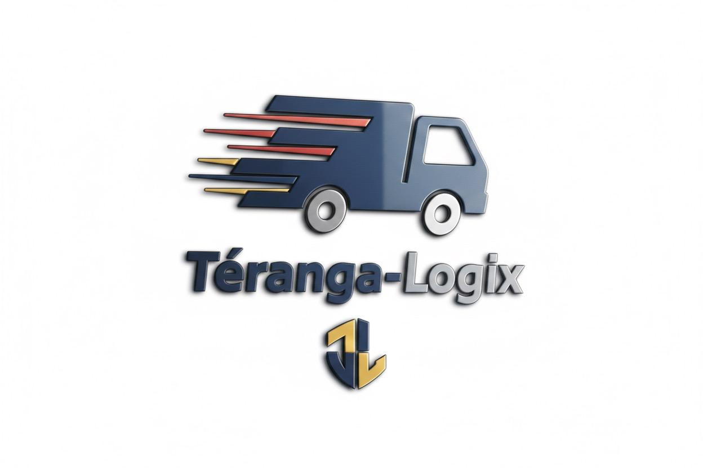

# 🚚 Teranga Logix - Plateforme de Transport et Logistique



## 📋 Description

Teranga Logix est une plateforme web complète de gestion de transport et logistique qui connecte les clients, administrateurs et développeurs dans un écosystème intégré. La plateforme offre des solutions pour le transport aérien, maritime et routier avec un système de gestion de devis, commandes, livraisons et bien plus.

## ✨ Fonctionnalités Principales

### 🔐 Authentification & Gestion des Utilisateurs
- Inscription et connexion sécurisées
- Trois types d'utilisateurs : Client, Admin, Développeur
- Gestion de profils personnalisés
- Réinitialisation de mot de passe

### 👥 Espace Client
- **Mes Devis** : Consultation de tous les devis personnels
- **Commandes** : Gestion complète des commandes
- **Livraisons** : Suivi en temps réel des livraisons
- **Loads** : Gestion des chargements
- **Boutiques** : Gestion multi-boutiques
- **Catalogues** : Consultation et gestion de catalogues produits
- **Entrepôts** : Gestion des entrepôts
- **Zones** : Configuration des zones de livraison
- **Débours** : Suivi des débours
- **Promotions** : Création et gestion de promotions
- **Réclamations** : Système de gestion des réclamations

### 👨‍💼 Espace Administrateur
- **Gestion des Utilisateurs** : CRUD complet sur les utilisateurs
- **Gestion des Devis** : Approbation, rejet ou mise en attente des demandes
- **Configuration** : Paramètres système et configurations avancées
- **Tableau de bord** : Vue d'ensemble avec statistiques en temps réel

### 👨‍💻 Espace Développeur
- **Gestion des Bugs** : Système complet de tracking et résolution de bugs
- **Erreurs Système** : Monitoring et résolution des erreurs
- **Gestion Email** : Envoi d'identifiants de récupération aux utilisateurs
- **Configuration Système** : Paramètres avancés et maintenance
- **Statistiques** : Vue d'ensemble des bugs actifs et erreurs non résolues

### 🌐 Fonctionnalités Publiques
- **Suivre mon colis** : Tracking de colis en temps réel
- **Demande de devis** : Formulaire de demande de cotation
- **Outils** : Outils de calcul et d'estimation
- **Produits** : Catalogue de produits et services
- **Entreprise** : Information sur l'entreprise
- **Service Commercial** : Contact avec le service commercial

## 🛠️ Technologies Utilisées

### Frontend
- **React 18.3** - Bibliothèque UI
- **TypeScript** - Typage statique
- **Vite** - Build tool et dev server
- **React Router DOM** - Routing
- **Tailwind CSS** - Framework CSS
- **shadcn/ui** - Composants UI
- **Lucide React** - Icônes
- **TanStack Query** - Gestion d'état serveur
- **React Hook Form** - Gestion de formulaires
- **Zod** - Validation de schémas

### Backend (Lovable Cloud)
- **Supabase** - Base de données PostgreSQL
- **Row Level Security (RLS)** - Sécurité des données
- **Authentication** - Gestion authentification
- **Storage** - Stockage de fichiers
- **Edge Functions** - Fonctions serverless

## 📦 Installation

### Prérequis
- Node.js (v18 ou supérieur)
- npm ou bun

### Étapes d'installation

1. **Cloner le repository**
```bash
git clone <YOUR_GIT_URL>
cd teranga-logix
```

2. **Installer les dépendances**
```bash
npm install
# ou
bun install
```

3. **Configurer les variables d'environnement**

Créer un fichier `.env` à la racine du projet :
```env
VITE_SUPABASE_PROJECT_ID=your_project_id
VITE_SUPABASE_PUBLISHABLE_KEY=your_publishable_key
VITE_SUPABASE_URL=your_supabase_url
```

4. **Lancer le serveur de développement**
```bash
npm run dev
# ou
bun run dev
```

L'application sera accessible sur `http://localhost:8080`

## 🏗️ Structure du Projet

```
teranga-logix/
├── public/              # Fichiers statiques
├── src/
│   ├── assets/         # Images et ressources
│   ├── components/     # Composants réutilisables
│   │   ├── ui/        # Composants shadcn/ui
│   │   └── dashboard/ # Composants dashboard
│   ├── hooks/         # Custom hooks
│   ├── integrations/  # Intégrations (Supabase)
│   ├── lib/           # Utilitaires
│   ├── pages/         # Pages de l'application
│   │   ├── admin/    # Pages admin
│   │   ├── client/   # Pages client
│   │   └── developer/ # Pages développeur
│   ├── App.tsx        # Composant racine
│   ├── main.tsx       # Point d'entrée
│   └── index.css      # Styles globaux
├── supabase/          # Configuration Supabase
│   └── migrations/    # Migrations base de données
└── README.md
```

## 🗄️ Base de Données

### Tables Principales

- **profiles** : Profils utilisateurs étendus
- **quotes** : Devis et demandes de cotation
- **orders** : Commandes
- **deliveries** : Livraisons
- **bugs** : Système de tracking de bugs
- **system_errors** : Erreurs système

### Sécurité
Toutes les tables sont protégées par des politiques RLS (Row Level Security) garantissant que :
- Les clients ne voient que leurs propres données
- Les admins ont un accès complet
- Les développeurs ont accès aux logs et bugs

## 🚀 Déploiement

Le projet peut être déployé via :
- **Lovable** : Déploiement automatique via le bouton "Publish"
- **Vercel** : Déploiement via GitHub integration
- **Netlify** : Déploiement continu depuis GitHub
- **Autres** : Tout service supportant les applications Vite/React

## 🔒 Sécurité

- Authentification sécurisée via Supabase Auth
- Row Level Security sur toutes les tables
- Validation des données avec Zod
- Protection CORS
- Gestion sécurisée des secrets

## 📱 Responsive Design

L'application est entièrement responsive et optimisée pour :
- 📱 Mobile (320px et plus)
- 📱 Tablette (768px et plus)
- 💻 Desktop (1024px et plus)
- 🖥️ Large Desktop (1440px et plus)

## 🤝 Contribution

Les contributions sont les bienvenues ! Pour contribuer :

1. Fork le projet
2. Créer une branche (`git checkout -b feature/AmazingFeature`)
3. Commit les changements (`git commit -m 'Add some AmazingFeature'`)
4. Push vers la branche (`git push origin feature/AmazingFeature`)
5. Ouvrir une Pull Request

## 📄 Licence

Ce projet est sous licence privée - voir le fichier LICENSE pour plus de détails.

## 👨‍💻 Auteurs

**Teranga Logix Team**

## 📞 Support

Pour toute question ou support :
- Email : support@terangalogix.com
- Site web : https://terangalogix.com
- Documentation : https://docs.terangalogix.com

## 🙏 Remerciements

- [Lovable](https://lovable.dev) - Plateforme de développement
- [shadcn/ui](https://ui.shadcn.com/) - Composants UI
- [Supabase](https://supabase.com) - Backend as a Service
- [Tailwind CSS](https://tailwindcss.com) - Framework CSS

---

**Made with ❤️ by Teranga Logix Team**